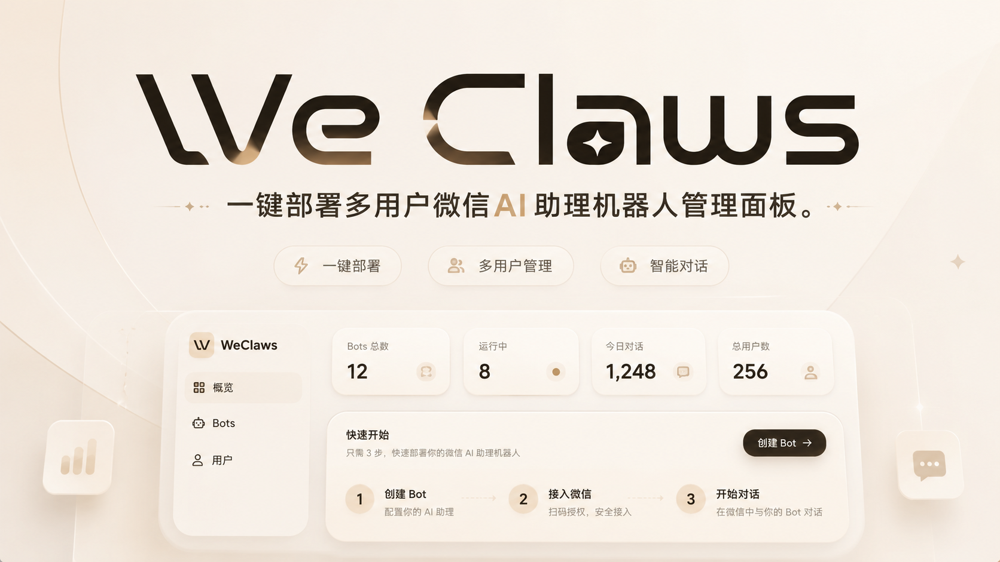
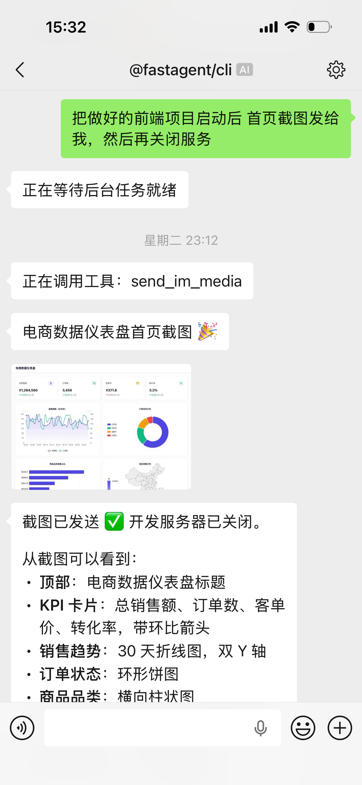
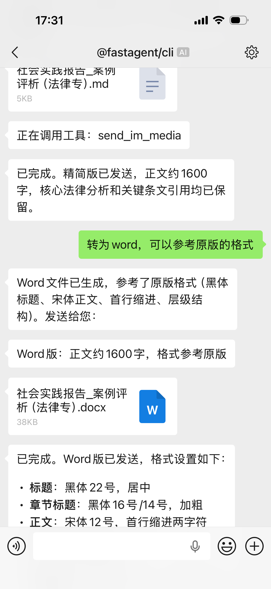
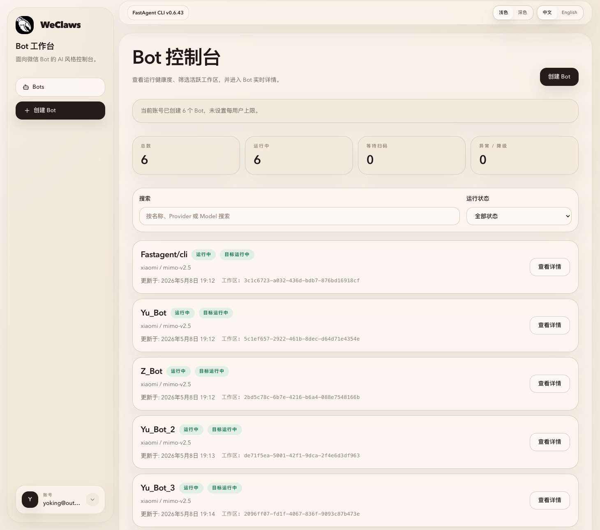
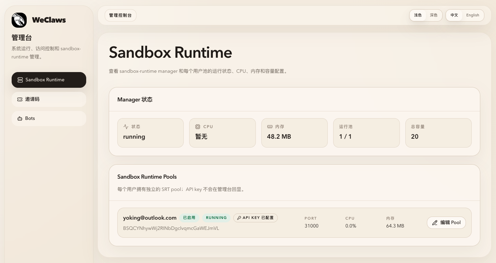
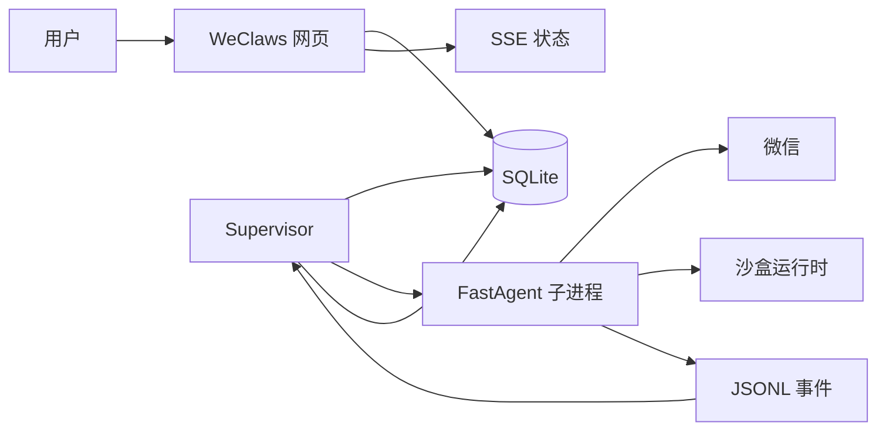

<div align="center">
  
  <h2>
    WeClaws
  </h2>
  <p><strong>一键部署、多用户、可长期托管的微信 AI 智能体控制台</strong></p>
  <p>
    <a href="https://github.com/baseclaw/weclaws"></a>
    <a href="https://www.npmjs.com/package/@fastagent/cli"></a>
    <a href="https://www.npmjs.com/package/@fastagent/sandbox-runtime"></a>
    <a href="LICENSE"></a>
  </p>
</div>

<p align="center">
  
</p>

WeClaws 是一个面向 **团队、多账号、按用户沙盒隔离和长期运行** 场景的微信 AI 智能体控制台。它把微信通道、工具调用、Skills、MCP、记忆、定时任务和沙盒能力，包装成一个可通过 Web 管理、可多用户注册、可持续托管的控制面。

> Self-hosted WeChat AI agent control plane for teams that need multi-user access, per-user sandbox isolation, and long-running operations. It packages WeChat connectivity, tool calling, Skills, MCP, memory, scheduled tasks, and sandboxed execution into a web-managed, multi-user platform for durable hosting.

如果你要的不是“本地手工跑一个机器人脚本”，而是“部署一次后，让多个用户各自管理、分享、登录并长期运行自己的微信 AI 机器人”，WeClaws 更接近这个答案。

- [3 分钟快速开始](#快速开始)
- [Docker Compose 一键部署](#docker-compose-一键部署)
- [查看项目分工](#weclaws-和-fastagent-的分工)
- [托管技能清单](#托管技能同步)
- [部署与运维文档](docs/manuals/README.md)

如果这个方向对你有帮助，欢迎点个 Star，后续功能和部署实践会持续公开。

<p align="center">
  
  
</p>

## 为什么值得关注

- **它是控制台，不是单机脚本。** WeClaws 提供用户账号、邀请码注册、模型配置、Bot 管理、Bot 快速分享、状态刷新和 Web 入口，适合真正交给多人使用。
- **它面向长期运行，不是一次性演示。** 启动、扫码登录、运行状态、异常可见、重启和 supervisor 收敛都围绕持续托管设计。
- **它强调隔离，不把所有 Bot 塞进同一执行环境。** `@fastagent/sandbox-runtime` 为不同用户准备独立的远程沙盒，降低工具执行互相影响的风险。
- **它不是重造 AI 运行时。** `@fastagent/cli` 继续负责真正的微信对话和工具执行，WeClaws 专注多用户控制面和运维体验。

## 适合谁

WeClaws 适合想把微信智能体从“手工命令行实验”升级成“可交付、可托管、可多人使用服务”的团队或个人：

- 你想部署一次，就让多个用户在网页里创建和管理自己的机器人。
- 你要给团队成员、客户或不同业务账号分别分配独立的微信 Bot。
- 你需要扫码登录、状态实时刷新、异常可见、实例可重启，而不是靠手工盯日志。
- 你希望把 Bot 通过二维码公开分享出去，让别人打开页面后直接扫码领取当前可用机器人。
- 你希望每个用户都有自己的模型配置、工作区和运行状态，而不是共用一套宿主机上下文。
- 你想保留 FastAgent 引擎的完整能力，同时给非工程用户一个 Web 管理入口。

## 典型使用场景

- 在云服务器上 self-host 一个多用户微信 AI 助手平台，供内部团队长期使用。
- 为多个运营、销售、客服或项目成员分配各自独立的微信机器人。
- 为单个 Bot 生成公开二维码分享页，别人无需登录 WeClaws 也能打开并在等待扫码时直接领取。
- 让不同机器人绑定不同模型服务商、模型版本和 API 密钥，避免全局环境变量绑死。
- 通过 Docker Compose 一次拉起网页、supervisor、沙盒运行时和 `browserless`，降低部署门槛。

## 你能用它做什么

- 在网页控制台创建和管理多个微信智能体机器人。
- 支持首个管理员自举、邀请码注册和多用户账号体系。
- 为每个用户保存多条模型服务配置，让不同机器人绑定不同服务商、模型和 API 密钥。
- 启动机器人后展示微信扫码登录二维码，登录状态通过 SSE 实时刷新。
- 支持 Bot 二维码公开分享，别人打开分享页后可在 Bot 等待扫码时直接扫码领取，且分享页会自动刷新到最新二维码。
- 停止、重启、查看运行状态，由 supervisor 统一管理实例生命周期。
- 用 SQLite 保存用户、机器人、模型配置、运行意图和状态，不把内存当作事实来源。
- 按用户分配远程沙盒进程池，让机器人在隔离环境中使用工具。
- 同步和管理 WeClaws 托管的技能包，同时保留用户自己的技能。
- 通过 Docker Compose 快速部署网页、supervisor、沙盒运行时和 `browserless` 四个服务。

<p align="center">
  
</p>

## 模型服务支持

WeClaws 不把模型服务写死在系统环境变量里。每个用户都可以在网页里创建多条模型配置，每条配置包含服务商、模型名、API 密钥、可选网关地址和接口类型；创建机器人时显式选择其中一条，之后也可以为单个机器人切换配置。也就是说，同一个用户可以让不同机器人分别使用 OpenAI、Anthropic、Google Gemini，或其他兼容接口的模型服务。

当前接口类型支持：

- `anthropic-messages`
- `openai-completions`
- `openai-responses`
- `google-generative-ai`

FastAgent CLI 还对 OpenAI Chat Completions 兼容接口下的 Kimi K2（`kimi-k2*`）和小米 MiMo（`mimo-v2*`）模型做了多轮工具调用兼容处理，适合接入 Kimi、小米等兼容网关。

## 背后的执行能力

WeClaws 基于 [`@fastagent/cli`](https://www.npmjs.com/package/@fastagent/cli) 和 [`@fastagent/sandbox-runtime`](https://www.npmjs.com/package/@fastagent/sandbox-runtime) 构建。具体版本、升级节奏和最新能力说明，建议直接查看对应 npm 页面或仓库内的版本矩阵手册。

[`@fastagent/cli`](https://www.npmjs.com/package/@fastagent/cli) 是用户真正使用的智能体运行时，更完整的命令、配置和能力说明可以查看它的 npm 页面。当前公开能力包括：

- 微信通道：扫码登录、登录态恢复、接收文本/图片/语音/文件，发送媒体和文件。
- 工具能力：读取、写入、编辑、搜索文件，执行命令，管理进程。
- MCP：接入外部工具，读取资源，管理全局 MCP 服务。
- 技能：安装、发现、列出，并在运行时调用技能。
- 模型服务：支持多种接口类型，可通过不同配置接入不同服务商和兼容网关。
- 长会话能力：记忆召回与沉淀、上下文自动压缩、后台记忆整理。
- 自动化能力：会话级定时任务，后台任务查看、等待和停止。
- 沙盒模式：支持本地沙盒和远程沙盒。
- 机器可读事件：通过 `--output jsonl` 输出事件流，让 WeClaws 能可靠解析二维码、登录、运行和错误状态。

如果你只想直接体验 FastAgent 命令行工具，可以单独安装：

```bash
npm install -g @fastagent/cli
fastagent --help
fastagent doctor
fastagent --channel weixin
```

如果你想把它变成多人网页服务，再使用 WeClaws。

`@fastagent/sandbox-runtime` 提供多用户沙盒运行时和进程池管理。WeClaws 用它为不同用户准备独立的远程执行环境，降低账号、文件和工具执行互相影响的风险。

## 沙盒镜像内置环境

默认 Compose 会构建 `sandbox-runtime` 镜像。镜像里的工具是在构建阶段预装的，方便机器人在远程沙盒里处理常见任务，不需要每个用户重复安装。

<p align="center">
  
</p>

当前内置环境包括：

- Node.js 20 运行环境。
- JavaScript / TypeScript 工具链：`bun`、`pnpm`。
- Python 工具链：`python3`、`uv`。
- 常用系统工具：`bash`、`curl`、`git`、`gh`、`ripgrep`、`jq`、`file`、`zip`、`unzip`、`socat`、`procps`。
- 飞书 / Lark 官方 CLI：`lark-cli`。
- 构建工具：`make`、`g++`。
- 媒体处理：`ffmpeg`。
- 文档和文本提取：`pdftotext`、`pdfinfo`、`pandoc`。
- 沙盒基础：`bubblewrap` 和 `@fastagent/sandbox-runtime`。
- 浏览器自动化：镜像已预置 `agent-browser` 客户端，默认 Compose 还会提供 `browserless` sidecar；受支持路径是由沙盒内 `agent-browser -p browserless` 或显式远程 `--cdp` 连接远程浏览器后端，不支持本地启动浏览器；少量一次性截图、PDF、scrape 任务也可以直接走 Browserless。

用户 API 密钥、OAuth token、微信登录态、设备配对态等个性化状态不会被打进镜像，仍然需要通过运行时配置或外部状态注入。

## 托管技能同步

WeClaws 内置一组官方托管技能，来源位于 `resources/skills/managed`。这些技能会同步到每个机器人实例的 `data/skills` 目录，供 FastAgent CLI 在运行时读取。

完整同步策略、目录标记和维护规则见 [托管技能手册](docs/manuals/managed-skills.md)。

策略摘要：

- `resources/skills/managed/manifest.json` 是默认同步清单的唯一来源。
- supervisor 在启动机器人前会尝试同步一次；同步失败或已有同步锁时，不阻断机器人启动。
- 机器人详情页也提供手动 `Sync Skills` 入口，只触发托管技能同步，不附带重启语义。
- 只托管实例级 `data/skills`，不会修改用户自管的 `workspace/.fastagent/skills`。
- 如果目标目录已有同名但没有 WeClaws 托管标记的技能，会保留用户内容并跳过。

当前默认同步的技能：

| 技能 | 用途 | 主要依赖 |
| --- | --- | --- |
| `weather` | 查询天气和预报 | `curl` |
| `github` | 通过 GitHub CLI 处理仓库、Issue、PR、CI | `gh` |
| `skill-creator` | 创建、编辑、校验和打包 FastAgent 技能 | `python3` |
| `video-frames` | 用 ffmpeg 从视频中截帧或生成检查图 | `ffmpeg` |
| `personal-planner` | 面向复杂任务的先规划、再执行工作流 | 无额外命令依赖 |
| `agent-browser` | 浏览器自动化技能说明已收编，默认走 Browserless sidecar | `agent-browser`、Browserless sidecar |
| `lark-*`（24 skills） | 官方公开的 Feishu/Lark 技能包，覆盖 IM、日历、文档、Drive、Sheets、Slides、Base、Task、Mail、Wiki、会议纪要、OKR、审批等域能力 | `lark-cli` |
| `ppt-skill` | 生成 HTML 网页 PPT，并交付本地可预览的 deck 资源目录 | `node` |
| `editorial-card-screenshot` | 生成 editorial 风格信息卡，并通过远程 Browserless 导出 PNG | `curl`、`python3`、Browserless sidecar |

技能是否真正可用，还取决于运行环境里是否具备对应命令和授权。例如 GitHub 技能需要可用的 `gh` 认证上下文；`lark-*` 技能依赖 bot 自己完成 `lark-cli` 的应用配置与授权；`ppt-skill` 依赖 `node` 执行校验脚本；`editorial-card-screenshot` 的截图导出依赖 Browserless 远程路径；用户级密钥和 OAuth 状态不会内置进镜像。

## WeClaws 和 FastAgent 的分工

| 层级 | 负责什么 | 不负责什么 |
| --- | --- | --- |
| `@fastagent/cli` | 智能体运行时、微信通道、工具调用、技能、MCP、记忆、定时任务、沙盒参数、JSONL 事件 | 多用户网页管理、账号权限、实例数据库、页面状态 |
| `@fastagent/sandbox-runtime` | 多用户远程沙盒、进程池、隔离执行环境 | 网页控制台、机器人生命周期、业务数据库 |
| `apps/supervisor` | 读取数据库里的运行意图，启动/停止 FastAgent 子进程，注入实例环境变量，消费事件并落库 | 网页界面、认证、用户交互 |
| `apps/web` | 控制台、HTTP 接口、Better Auth、SSE、机器人/模型配置管理、技能同步入口 | 直接拉起本地进程、直接持有运行态真相 |
| `packages/db` | SQLite 结构、迁移、仓储 API、持久化语义 | 业务界面、外部运行时 |
| `packages/shared` | 跨工作区的稳定类型、路径规则、JSONL 结构 | 各工作区的内部实现 |

核心原则：网页只写入“用户想让机器人运行”的持久化意图；supervisor 才拥有运行时；FastAgent CLI 才是真正执行智能体的进程。



## 快速开始

### 本地开发

要求：

- Node.js 20+
- pnpm
- 一个可用的模型服务 API 密钥，登录后在网页控制台创建用户级模型配置

```bash
pnpm install
cp .env.example .env
pnpm db:generate
pnpm db:migrate
```

首次启动前确认仓库根 `.env` 存在，并把 `BETTER_AUTH_SECRET=replace-me` 改成随机密钥，例如 `openssl rand -hex 32` 的输出；缺少根 `.env` 会导致 web 运行时报 `DATABASE_URL` / `APP_BASE_URL` / `BETTER_AUTH_SECRET` 缺失。

分别启动网页和 supervisor：

```bash
pnpm dev:web
pnpm dev:supervisor
```

打开 `http://localhost:3000`，注册/登录后：

1. 创建一条或多条模型配置。
2. 创建机器人并绑定模型配置。
3. 启动机器人。
4. 扫描页面展示的微信二维码完成登录。

### Docker Compose 一键部署

默认 Compose 栈包含网页、supervisor、sandbox-runtime 和 `browserless` 四个服务。复制环境文件后，一条命令即可拉起：

```bash
cp infra/compose/.env.example infra/compose/.env
docker compose --env-file infra/compose/.env -f infra/compose/docker-compose.yml up -d
```

生产部署可以直接使用已发布镜像，不需要在服务器上构建：

```bash
docker compose \
  --env-file infra/compose/.env \
  -f infra/compose/docker-compose.yml \
  -f infra/compose/docker-compose.prod.yml \
  pull

docker compose \
  --env-file infra/compose/.env \
  -f infra/compose/docker-compose.yml \
  -f infra/compose/docker-compose.prod.yml \
  up -d
```

生产环境至少确认：

- `APP_BASE_URL` 和实际访问地址一致。
- `BETTER_AUTH_SECRET` 已替换成真实随机密钥。
- `WEB_ADMIN_EMAILS` 填写首个管理员邮箱；首次注册命中该邮箱时可以完成管理员自举。
- 使用生产覆盖配置时，`WECLAWS_DATA_ROOT` 指向宿主机上的持久化目录；建议使用 `/srv/weclaws/data` 这类标准服务目录，避免路径里出现个人用户名、临时项目名等宿主机细节。
- 用户登录后必须创建模型配置，并让机器人绑定该配置；仓库级 `FASTAGENT_*` 环境变量不再作为机器人默认模型来源。

上线后的基本路径是：

1. 首个管理员用 `WEB_ADMIN_EMAILS` 中的邮箱完成注册。
2. 管理员在后台生成邀请码。
3. 普通用户用邀请码注册账号。
4. 用户创建模型配置和机器人，扫码登录微信后即可运行。

```dotenv
WECLAWS_DATA_ROOT=/srv/weclaws/data
```

完整部署说明见 [Docker 部署手册](docs/manuals/docker-deployment-runbook.md)。

## 项目结构

```text
apps/
  web/          Next.js 控制台、接口、认证、SSE
  supervisor/  FastAgent 子进程管理和状态收敛
packages/
  db/          SQLite / Drizzle 结构、迁移、仓储 API
  shared/      跨工作区的契约、常量、路径和 JSONL 结构
infra/
  compose/     Docker Compose 拓扑和生产覆盖配置
  docker/      网页、supervisor、sandbox-runtime 镜像
docs/manuals/  稳定的运维、契约、环境变量和部署文档
resources/
  skills/      WeClaws 托管技能包
```

## 常用开发命令

```bash
pnpm test
pnpm typecheck
pnpm lint
pnpm --filter @weclaws/web test
pnpm --filter @weclaws/supervisor test
pnpm --filter @weclaws/db test
pnpm test:fastagent-contract
```

`pnpm test:fastagent-contract` 只在具备所需 FastAgent/模型服务环境时运行。

## 设计原则

- SQLite 是控制面的事实来源。
- 网页不直接管理本地进程，只写入持久化运行意图。
- Supervisor 拥有运行时，负责持续收敛状态。
- FastAgent CLI 通过外部契约接入，不依赖它的内部包结构。
- 机器人路径通过共享路径解析器派生，不持久化宿主机特定路径。
- 不为已经退役的行为添加兼容层，除非明确需要。

## 更多文档

- [FastAgent CLI 接入契约](docs/manuals/fastagent-cli-contract.md)
- [Docker 部署手册](docs/manuals/docker-deployment-runbook.md)
- [环境变量和密钥矩阵](docs/manuals/env-and-secrets-matrix.md)
- [托管技能手册](docs/manuals/managed-skills.md)
- [版本矩阵](docs/manuals/version-matrix.md)
- [文档索引](docs/manuals/README.md)

## 许可证

[MIT](LICENSE)
